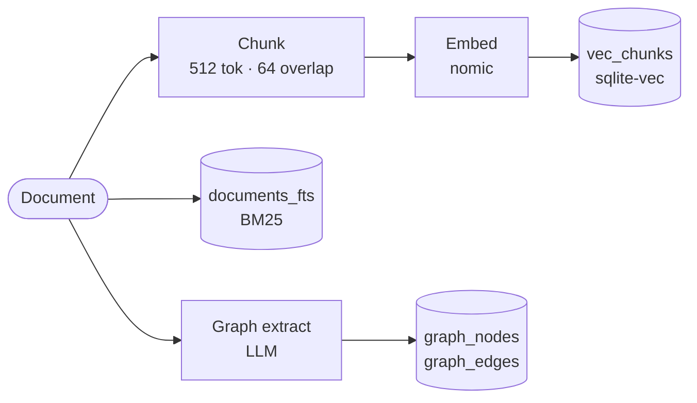
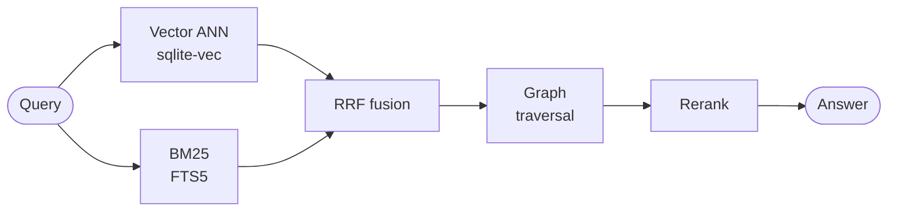
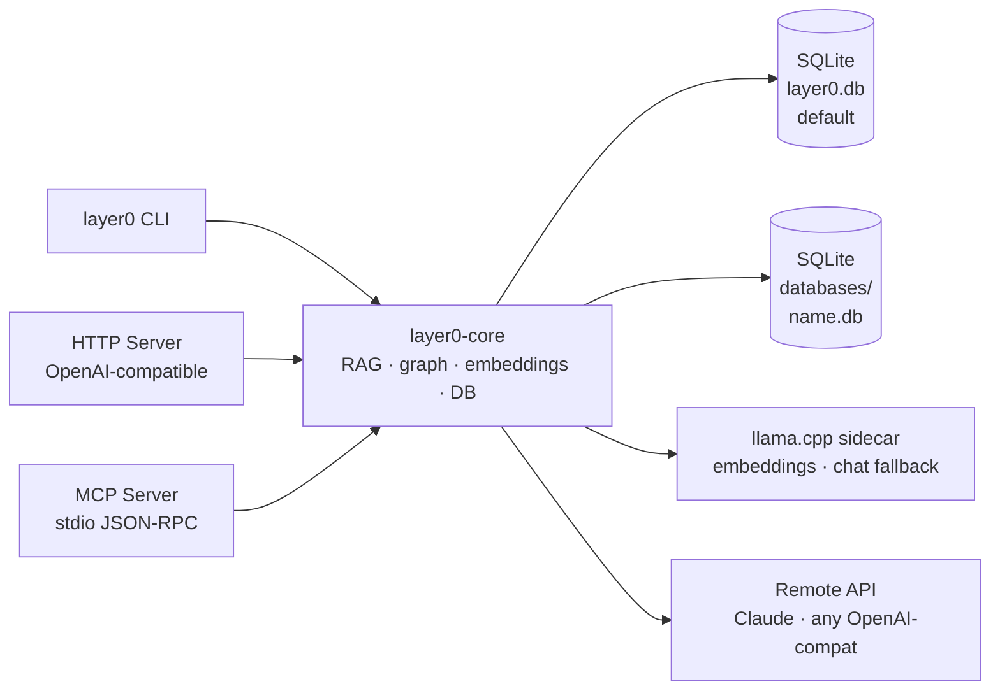

# 🌐 layer0

**Fast. Minimal. No bloat. Fully self-hostable.**

Hybrid RAG (vector + knowledge graph) and long-term memory for AI agents — written in Rust, runs offline, no vendor lock-in.

One binary. One SQLite file per database. `layer0 serve` and you're done.

[](https://github.com/amajorai/layer0)
[](https://github.com/amajorai/layer0)
[](https://github.com/amajorai/layer0)
[](https://github.com/amajorai/layer0/issues)
[](https://github.com/amajorai/layer0/releases)

## Get started

### For humans

Download a prebuilt binary from [GitHub Releases](https://github.com/amajorai/layer0/releases) (Linux/macOS/Windows) — or build from source:

```sh
cargo build --release
```

Then:

```sh
layer0 init     # write config, generate MCP client files
layer0 serve    # auto-downloads models, starts sidecar, serves on :8080
```

```sh
layer0 store "layer0 indexes chunks with sqlite-vec."
layer0 ask "What does layer0 use for vector search?"

# Named databases — each gets its own isolated SQLite file
layer0 db create-database myproject
layer0 store "project context" --database myproject
layer0 search "context" --database myproject
layer0 db delete-database myproject
```

Set `ANTHROPIC_API_KEY` before `serve` to use Claude for chat/graph extraction instead of the local gemma fallback.

### For AI agents

Install the skills so your agent can set up and use layer0 without manual steps:

```sh
npx skills add amajorai/layer0
```

This installs two skills into your agent:
- **layer0-setup** — install, configure, and start layer0
- **layer0-memory** — store, search, and recall memories across sessions

To connect via MCP, add to `.claude/mcp.json` (or `.cursor/mcp.json`):

```json
{
  "mcpServers": {
    "layer0": { "command": "layer0", "args": ["mcp"] }
  }
}
```

`layer0 init` writes this file automatically.

MCP tools: `store_memory`, `search_memory`, `rag_query`, `get_document`, `delete_memory`, `graph_query`, `memory_stats`, `list_databases`, `create_database`, `delete_database`, `list_collections`, `create_collection`, `delete_collection`.

## How it works

**Ingest**


**Retrieval**


## Features

- **Hybrid RAG** — vector ANN + knowledge graph fused with Reciprocal Rank Fusion, then reranked. Or run `vector`-only or `graph`-only mode.
- **Chunked retrieval** — documents split into overlapping chunks, embedded per chunk for tight context.
- **sqlite-vec ANN index** — cosine KNN over a `vec0` virtual table.
- **Knowledge graph, auto-built at ingest** — entities + relationships extracted by the LLM at store time.
- **Local-first, zero-config** — `serve` installs llama.cpp and downloads models automatically on first run.
- **No vendor lock-in** — fully offline with local gemma, or swap in any OpenAI-compatible backend via config.
- **OpenAI-compatible API**, MCP server, and CLI (including a `layer0 config` TUI).
- **Optional API-key auth**, multi-database / multi-collection scoping.
- **Per-database isolation** — each named database gets its own SQLite file; `default` stays backward-compatible.
- **Self-update** — `layer0 update` pulls the latest release from GitHub.
- No Docker, no external services.

## Configuration

Global config: `~/.layer0/config.toml`. Edit with `layer0 config` (TUI) or by hand. Full commented template at `config/default.toml`.

Environment overrides: `LAYER0__` prefix with double underscores, e.g. `LAYER0__SERVER__PORT=9000`. `ANTHROPIC_API_KEY` is picked up automatically.

### Example

```toml
[server]
host = "127.0.0.1"
port = 8080
cors_origins = ["*"]
# api_key = "change-me"

[llm]
base_url = "http://127.0.0.1:8081"
embedding_model = "nomic-embed-text-v1.5"
timeout_secs = 120
context_length = 2048

[chat]
provider = "anthropic"
base_url = "https://api.anthropic.com"
model = "claude-haiku-4-5"
timeout_secs = 120

[embeddings]
dimensions = 768        # must match the embedding model
batch_size = 16
search_limit = 1000

[chunking]
chunk_size = 512
chunk_overlap = 64

[rag]
mode = "hybrid"         # hybrid | vector | graph
rerank = true
extract_graph = true

[installer]
llama_server_port = 8081
embedding_repo = "nomic-ai/nomic-embed-text-v1.5-GGUF"
embedding_file = "nomic-embed-text-v1.5.Q4_K_M.gguf"
chat_repo = "bartowski/google_gemma-4-E4B-it-GGUF"
chat_file = "google_gemma-4-E4B-it-Q4_K_M.gguf"
chat_server_port = 8082
auto_start = true

[update]
repo = "amajorai/layer0"
auto_check = true
auto_update = false
```

### Parameters

**`[server]`**

| Key | Default | Description |
|-----|---------|-------------|
| `host` | `"127.0.0.1"` | Bind address. `"0.0.0.0"` to expose on the network. |
| `port` | `8080` | HTTP port. |
| `cors_origins` | `["*"]` | Allowed CORS origins. |
| `api_key` | _(unset)_ | Require `X-API-Key` or `Authorization: Bearer` on all requests except `/health`. |

**`[database]`**

| Key | Default | Description |
|-----|---------|-------------|
| `max_connections` | `5` | SQLite connection pool size. |

**`[llm]`** — local embeddings sidecar (OpenAI wire format)

| Key | Default | Description |
|-----|---------|-------------|
| `base_url` | `"http://127.0.0.1:8081"` | Embeddings endpoint. Point at any OpenAI-compatible server to skip the sidecar. |
| `embedding_model` | `"nomic-embed-text-v1.5"` | Model name in embedding requests. |
| `rerank_model` | _(unset)_ | Optional dedicated reranking model. |
| `api_key` | _(unset)_ | API key for the embeddings endpoint. |
| `timeout_secs` | `120` | Per-request timeout. |
| `context_length` | `2048` | Model context window (tokens). |

**`[chat]`** — remote chat backend (resolution: remote key present → remote; no key → local gemma)

| Key | Default | Description |
|-----|---------|-------------|
| `provider` | `"anthropic"` | Provider label. |
| `base_url` | `"https://api.anthropic.com"` | Any OpenAI-compatible endpoint works. |
| `model` | `"claude-haiku-4-5"` | Model identifier. |
| `api_key` | _(unset)_ | Falls back to `ANTHROPIC_API_KEY`. Absent → local gemma fallback. |
| `timeout_secs` | `120` | Per-request timeout. |

**`[embeddings]`**

| Key | Default | Description |
|-----|---------|-------------|
| `dimensions` | `768` | Vector size. **Must match the model** (nomic = 768). Changing requires re-embedding. |
| `batch_size` | `16` | Chunks per embedding request. |
| `search_limit` | `1000` | Max candidates from the vector index before reranking. |

**`[chunking]`**

| Key | Default | Description |
|-----|---------|-------------|
| `chunk_size` | `512` | Target chunk size in tokens. |
| `chunk_overlap` | `64` | Overlap between chunks in tokens. |

**`[rag]`**

| Key | Default | Description |
|-----|---------|-------------|
| `mode` | `"hybrid"` | `hybrid` — vector + graph + RRF + rerank. `vector` — semantic only. `graph` — graph-led, vector-seeded. |
| `rerank` | `true` | Reranking pass on final results. |
| `extract_graph` | `true` | Build knowledge graph at ingest. Auto-skipped when `mode = "vector"`. |

**`[installer]`** — llama.cpp + model management (paths default under `~/.layer0/`)

| Key | Default | Description |
|-----|---------|-------------|
| `llama_server_port` | `8081` | Embedding sidecar port. Must match `[llm].base_url`. |
| `embedding_repo` | `"nomic-ai/nomic-embed-text-v1.5-GGUF"` | HuggingFace repo for the embedding model. |
| `embedding_file` | `"nomic-embed-text-v1.5.Q4_K_M.gguf"` | GGUF file to download. |
| `chat_repo` | `"bartowski/google_gemma-4-E4B-it-GGUF"` | HuggingFace repo for local chat fallback. Try `google_gemma-4-E2B-it-GGUF` for lighter hardware. |
| `chat_file` | `"google_gemma-4-E4B-it-Q4_K_M.gguf"` | GGUF file to download. |
| `chat_server_port` | `8082` | Chat sidecar port. |
| `hf_token` | _(unset)_ | HuggingFace token for gated models. |
| `auto_start` | `true` | Install llama.cpp, download models, and start sidecars on `layer0 serve`. |

**`[update]`**

| Key | Default | Description |
|-----|---------|-------------|
| `repo` | `"amajorai/layer0"` | GitHub repo to pull releases from. |
| `auto_check` | `true` | Log when a newer release exists at startup. |
| `auto_update` | `false` | Auto-apply updates at startup (takes effect on next restart). |

## CLI — Databases & Collections

```sh
# Database management
layer0 db databases                          # list all databases
layer0 db create-database <name>             # create (also creates ~/.layer0/databases/<name>.db)
layer0 db delete-database <name>             # delete database and its .db file

# Collection management
layer0 db collections <database>             # list collections in a database
layer0 db create-collection <database> <name>
layer0 db delete-collection <database> <name>

# Scoped operations
layer0 store "text" --database mydb --collection notes
layer0 search "query" --database mydb --collection notes
layer0 ask "question" --database mydb

# Database stats and document list
layer0 db stats
layer0 db list --database mydb --collection notes
```

## HTTP API

Base: `http://localhost:8080`

```
POST /v1/documents              store (auto-chunked + embedded)
POST /v1/search                 hybrid search (vector + BM25 [+ graph] [+ rerank])
POST /v1/rag                    answer grounded in memory
GET/DELETE /v1/documents[/:id]  list / fetch / delete
/v1/graph/...                   nodes, edges, BFS query
POST /v1/embeddings             OpenAI-compatible
POST /v1/chat/completions       OpenAI-compatible (routes to the chat backend)
GET  /v1/stats                  counts
GET  /health                    liveness (no auth)

# Database & collection management
GET    /v1/db                                list databases
POST   /v1/db                                create database  {"name":"mydb"}
GET    /v1/db/:database                      get database
DELETE /v1/db/:database                      delete database + its .db file
GET    /v1/db/:database/collections          list collections
POST   /v1/db/:database/collections          create collection  {"name":"notes"}
GET    /v1/db/:database/:collection          get collection
DELETE /v1/db/:database/:collection          delete collection

# Scoped data routes (each opens the database's own .db file)
/v1/db/:database/:collection/documents       store / list
/v1/db/:database/:collection/search          search
/v1/db/:database/:collection/rag             RAG query
/v1/db/:database/:collection/graph/...       nodes, edges, BFS
/v1/db/:database/:collection/stats           scoped counts
```

## Architecture



Chat resolution: ACP *(planned)* → remote backend (when API key present) → local gemma sidecar. Embeddings are always local unless `[llm].base_url` points at a remote endpoint.

## Database schema

Each database is a self-contained SQLite file. The `default` database lives at `~/.layer0/layer0.db`; every other named database lives at `~/.layer0/databases/<name>.db`.

| Table | Contents |
|-------|----------|
| `documents` | Source documents + metadata (FTS5 mirror in `documents_fts`) |
| `chunks` | Per-document chunks (the retrieval unit) |
| `vec_chunks` | sqlite-vec `vec0` cosine index over chunk embeddings |
| `graph_nodes` / `graph_edges` | Knowledge graph |
| `collections` | Named sub-scopes within the database |
| `databases` | Registry of all named databases (in `layer0.db` only) |
| `models` | Model registry (in `layer0.db` only) |

Database names may contain letters, digits, `_`, `-`, `.` — max 64 characters. The names `NUL`, `CON`, `PRN`, `AUX`, `COM*`, `LPT*` are reserved on Windows and rejected.

## License

MIT

## Star History

<a href="https://www.star-history.com/#amajorai/layer0&Date">
 <picture>
   <source media="(prefers-color-scheme: dark)" srcset="https://api.star-history.com/svg?repos=amajorai/layer0&type=Date&theme=dark" />
   <source media="(prefers-color-scheme: light)" srcset="https://api.star-history.com/svg?repos=amajorai/layer0&type=Date" />
   
 </picture>
</a>
